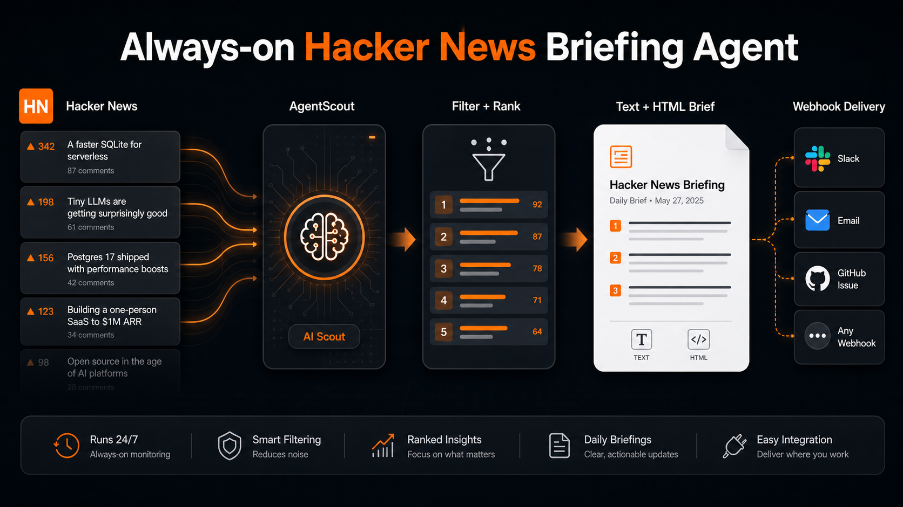

> 🌐 本文档由 [Shubhamsaboo/awesome-llm-apps](https://github.com/Shubhamsaboo/awesome-llm-apps) 翻译,英文原版见原项目。

# 📰 常驻 Hacker News 简报智能体

AgentScout 是一个基于 Google ADK 构建的常驻 Hacker News 简报智能体。它会扫描 Hacker News 上关于 AI 智能体、MCP、编码智能体、工作流自动化和 LLM 应用的高信噪比文章,并把最佳链接整理成一份精炼的工程简报。

本应用既可以作为交互式 ADK 智能体运行,也可以作为定时后端服务运行。用 ADK Web 手动索取简报,或者跑起 FastAPI 调度钩子,让 Cloud Scheduler 每天触发一次 Hacker News 简报,并通过 Gmail、Slack、Linear、Jira 或内部摘要工作流发送。



## 功能特性

- **Hacker News 监控**:从 Hacker News 找出 AI 智能体、MCP、编码智能体、自动化和 LLM 应用相关的文章。
- **信噪比排序**:按相关性、点赞数、评论数和首页位置对文章打分。
- **简报生成**:输出纯文本和 HTML 双版本简报,含摘要、链接和下一步行动。
- **Google ADK 智能体**:暴露 `root_agent`,用户可在 ADK Web 中直接索取简报。
- **调度友好的后端**:内置 HTTP 和 Pub/Sub 端点,适配 Cloud Scheduler 或其他自动化系统。
- **Gmail 与 Webhook 投递**:`dry_run=false` 时通过 Gmail API 或通用 webhook 发送简报。
- **安全的投递流程**:默认 dry-run 模式,未显式配置凭据绝不发送。

## 工作原理

1. AgentScout 从确定性示例数据或 Hacker News 实时首页收集文章。
2. 过滤出 AI 智能体与 LLM 应用相关主题。
3. 对工程师和产品构建者最有用的文章进行排序。
4. 渲染纯文本和 HTML 双版本的每日简报。
5. 通过 ADK Web、HTTP 触发器或 Pub/Sub 推送端点返回结果。
6. 如已启用投递,调度 API 通过 Gmail 发送简报,或 POST 到 `AGENTSCOUT_WEBHOOK_URL`。

## 环境要求

- Python 3.10+
- ADK Web 所需的 Gemini API Key
- 可选:用于直接邮件投递的 Gmail OAuth 凭据
- 可选:用于 Slack、Linear、Jira、GitHub Issues、SendGrid 或内部工作流的 webhook URL

## 安装

```bash
git clone https://github.com/Shubhamsaboo/awesome-llm-apps.git
cd awesome-llm-apps/always_on_agents/always_on_hn_briefing_agent
pip install -r requirements.txt
export GOOGLE_API_KEY="your_gemini_api_key"
```

## 方式一:在 ADK Web 中运行

想跟智能体对话、手动索取简报时,用 ADK Web。

```bash
adk web .
```

打开 ADK Web UI,选择 `always_on_hn_briefing_agent`。

试试这样的提示词:

```text
给我今天的 AgentScout 简报。
```

```text
侦察一下 Hacker News 上关于 AI 智能体和 LLM 应用排名前 3 的文章。
```

```text
给我看 Hacker News 上关于 MCP、编码智能体和工作流自动化信噪比最高的条目。
```

## 方式二:本地运行调度 API

想让 AgentScout 像常驻后端服务一样运行时,用调度 API。这也是你部署到 Cloud Run 后、由 Cloud Scheduler 触发的同一套接口。

启动调度后端:

```bash
uvicorn scheduler_api:app --host 0.0.0.0 --port 8000
```

另开一个终端,预览一次不带投递的定时运行:

```bash
curl "http://127.0.0.1:8000/agent-scout/dry-run?top_n=3&live=false"
```

以 dry-run 模式触发调度路径:

```bash
curl -X POST "http://127.0.0.1:8000/agent-scout/trigger" \
  -H "Content-Type: application/json" \
  -d '{"dry_run": true, "top_n": 5, "live": false}'
```

dry-run 模式会返回渲染好的简报和投递状态,但不发送任何东西。

为当前进程启用 Hacker News 实时扫描:

```bash
export AGENTSCOUT_LIVE_HN=true
```

也可以按请求覆盖 live 模式:

```bash
curl -X POST "http://127.0.0.1:8000/agent-scout/trigger" \
  -H "Content-Type: application/json" \
  -d '{"dry_run": true, "top_n": 5, "live": true}'
```

## 方式三:启用定时投递

投递是显式开启的。除非请求体包含 `"dry_run": false` 且配置了至少一种投递方式,AgentScout 不会发邮件或调用 webhook。

投递模式行为:

- `AGENTSCOUT_DELIVERY=gmail` 通过 Gmail API 发送。
- `AGENTSCOUT_DELIVERY=webhook` POST 到 `AGENTSCOUT_WEBHOOK_URL`。
- 若未设置 `AGENTSCOUT_DELIVERY`,AgentScout 优先在 Gmail 配置齐全时用 Gmail,否则在配置了 webhook URL 时用 webhook。

### Gmail 投递

想让 AgentScout 把每日简报直接发进邮箱,用 Gmail。创建一个有 Gmail API 权限的 Google OAuth 客户端,用 `https://www.googleapis.com/auth/gmail.send` 权限范围生成 refresh token,然后设置:

```bash
export AGENTSCOUT_DELIVERY="gmail"
export AGENTSCOUT_EMAIL_TO="you@example.com"
export AGENTSCOUT_EMAIL_FROM="you@example.com"
export AGENTSCOUT_GMAIL_CLIENT_ID="your_google_oauth_client_id"
export AGENTSCOUT_GMAIL_CLIENT_SECRET="your_google_oauth_client_secret"
export AGENTSCOUT_GMAIL_REFRESH_TOKEN="your_gmail_refresh_token"

curl -X POST "http://127.0.0.1:8000/agent-scout/trigger" \
  -H "Content-Type: application/json" \
  -d '{"dry_run": false, "top_n": 5, "live": true}'
```

AgentScout 会发送一封 multipart 邮件,同时包含简报的纯文本和 HTML 版本。

### Webhook 投递

想把简报路由到 Slack、Linear、Jira、GitHub Issues、SendGrid 或你自己的内部工作流,用 webhook 投递。

```bash
export AGENTSCOUT_DELIVERY="webhook"
export AGENTSCOUT_WEBHOOK_URL="https://example.com/agent-brief-webhook"
export AGENTSCOUT_WEBHOOK_TOKEN="optional_bearer_token"

curl -X POST "http://127.0.0.1:8000/agent-scout/trigger" \
  -H "Content-Type: application/json" \
  -d '{"dry_run": false, "top_n": 5, "live": true}'
```

webhook 会收到 `subject`、`text`、`html`、`stories` 和 `next_actions` 字段。

## Cloud Scheduler 钩子

把调度 API 部署到 Cloud Run 或其他 HTTP 服务后面,在该环境中配置好 Gmail 或 webhook 投递,然后从 Cloud Scheduler 调用以下端点之一。

直接 HTTP 触发:

```text
https://YOUR_CLOUD_RUN_URL/agent-scout/trigger
```

请求体:

```json
{
  "dry_run": false,
  "top_n": 5,
  "live": true
}
```

测试定时任务时先把 `dry_run` 设为 `true`。只有在 Gmail 或 webhook 投递配置完成后才设为 `false`。

推荐的工作日简报时间表:

```text
0 9 * * 1-5
```

Pub/Sub 推送端点:

```text
https://YOUR_CLOUD_RUN_URL/agent-scout/pubsub
```

Pub/Sub 推送需把同样的 JSON 负载作为 base64 编码的消息数据发送。

## 输出示例

```json
{
  "subject": "AgentScout Hacker News brief - 2026-06-08",
  "watch_mode": "sample",
  "stories": [
    {
      "title": "Show HN: An open-source framework for reliable AI agent workflows",
      "points": 428,
      "comments": 116,
      "summary": "Framework discussion with practical tradeoffs around orchestration, retries, state, and tool execution."
    }
  ],
  "next_actions": [
    "Open the highest-comment thread and extract objections or implementation patterns."
  ]
}
```
